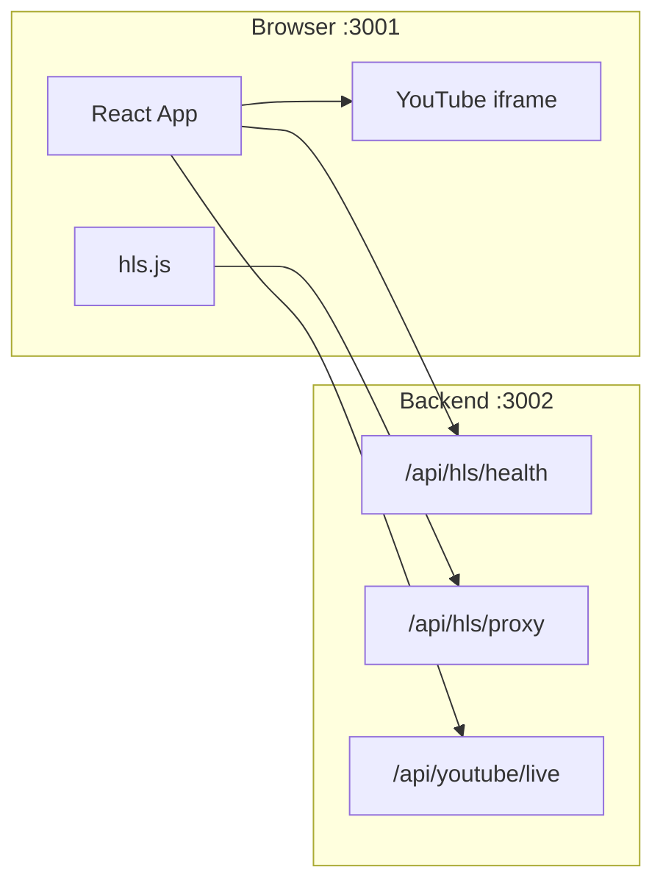

# Live Stream Aggregator

Sports live-stream aggregator built for the take-home assignment. It uses the same HLS.js player stack as `frontend/`, but loads a curated catalog from hosted YAML (GitHub raw) instead of IPTV M3U playlists.

Package name: `live-stream-aggregator`

## Running with backend

HLS playback and YouTube live detection work best with the sibling API server in `../live-stream-aggregator-backend` (Hono, port **3002**). It proxies HLS manifests/segments (fixes CORS), runs server-side health probes, and hosts the YouTube live scrape.

**Two terminals:**

```bash
# Terminal 1 — backend
cd ../live-stream-aggregator-backend
npm install
npm run dev

# Terminal 2 — frontend
cd sports-streaming
cp .env.example .env
npm install
npm run dev
```

`VITE_API_BASE` is **required**. The app fails at startup if it is missing. Copy `.env.example` → `.env` or use the npm scripts (they set `http://localhost:3002` by default).

See `../live-stream-aggregator-backend/README.md` for API details, security limits, and deploy notes.

## Quick start

```bash
npm install
cp .env.example .env
npm run dev               # production profile (default in streams.yaml)
npm run dev:test          # Apple HLS sample streams only
npm run dev:production    # explicit production profile
npm run build             # requires VITE_API_BASE at build time
npm run preview
npm test                  # unit tests
```

Open http://localhost:3001

## Live demo script

Use this order during a review call:

1. Start **backend** on port 3002, then **frontend** with `VITE_API_BASE` set.
2. Open **FIBA 3x3** (Akamai HLS) or **Cricket Gold** (Sofast) first — stable public feeds, shows ABR and proxy playback.
3. Open **Red Bull Padel** — second HLS origin, shows source switching.
4. Try **Basketball / NFL / Soccer IPTV** samples only to demonstrate failover or public-feed proxying — say upfront they are demo IPTV URLs, not owned streams.
5. Open **YouTube** events only if the channel is actually live; swap YAML handles to official broadcaster channels before the event.

If the amber **Unverified** banner appears, click **Retry connection** after the backend is up.

Required env (copy `.env.example` → `.env`):

```bash
VITE_API_BASE=http://localhost:3002
```

Optional:

```bash
# Override hosted catalog URL (defaults to raw GitHub streams.yaml on main)
# VITE_CATALOG_URL=https://raw.githubusercontent.com/tejasvi-mehra/live-stream-aggregator/main/config/streams.yaml

# Disable all YouTube sources at build time (no UI toggle)
VITE_YOUTUBE_ENABLED=false

# Override YAML activeProfile without editing streams.yaml
VITE_STREAM_PROFILE=test
```

## Config structure

The catalog lives in `config/streams.yaml` in this repo. At runtime the app **fetches** it from GitHub (no frontend redeploy needed when you edit streams):

```
https://raw.githubusercontent.com/tejasvi-mehra/live-stream-aggregator/main/config/streams.yaml
```

Override with `VITE_CATALOG_URL` if you use a fork or branch. After editing YAML on GitHub, refresh the app (or click **Retry catalog**) — allow a minute for GitHub’s CDN cache to update.

Streams are structured as **categories → events → streams**:

```yaml
activeProfile: test

profiles:
  test:
    description: Apple HLS sample streams for development and QA.
    categories:
      - id: basketball
        name: Basketball
        events:
          - id: demo-basketball
            name: Demo Basketball
            logo: https://example.com/logo.png
            streams:
              - url: https://example.com/stream/master.m3u8
              - url: https://example.com/stream/backup.m3u8
              - type: youtube
                channelUrl: https://www.youtube.com/@ChannelHandle
```

### Stream fields

| Field | Applies to | Description |
|-------|------------|-------------|
| `url` | HLS (default) | Direct m3u8 manifest URL |
| `type: youtube` | YouTube | Marks source as a YouTube channel |
| `channelUrl` | YouTube | Channel page (`/channel/UC...`, `/@handle`, `/user/name`) |
| `channelId` | YouTube | Optional `UC...` ID; resolved automatically when omitted |
| `hidden: true` | Any | Backend-only source — used for playback/failover, not shown on event cards |

### Profiles

| Profile | Purpose | Contents |
|---------|---------|----------|
| `test` | Development / QA | Apple HLS demo streams only — same two manifests shared across all sports, no YouTube, no hidden sources |
| `production` | Live demo (**default**) | Curated mix of HLS, YouTube, and hidden public IPTV demo sources across basketball, cricket, football, motorsport, and soccer |

Switch profiles via `activeProfile` in YAML or `VITE_STREAM_PROFILE=test|production`.

## Features

### Catalog and UI

- Events grouped by sport category (alphabetically)
- Search and category filter pills
- Event cards show live/offline status, source count, and YouTube badge when applicable
- Empty sport categories are still shown with a “No events for this category” message when filtered down to zero events

### Multi-source playback

Each event can have multiple sources. The player footer shows clickable source links:

- HLS sources → **Source 1**, **Source 2**, …
- YouTube sources → **YouTube 1**, **YouTube 2**, …

Numbering is per type and includes hidden backend sources in order.

**Next / Prev** cycles playable sources within the same event only (not across events).

**Failover:** on a fatal HLS error, the player automatically tries the next playable source in YAML order.

**Hidden sources** (e.g. backend HLS URLs in production) are not listed on event cards but participate in playback, failover, and source numbering.

### HLS player

- HLS.js with `lowLatencyMode`, Safari native HLS fallback
- ABR quality selector, picture-in-picture, volume/mute persistence
- Auto-play next source toggle

### YouTube live streams

YouTube entries in `profiles.production` are **sample channel handles** (podcast/show accounts). Swap `channelUrl` / `channelId` to official league or broadcaster channels when those events are actually live.

Add a YouTube source to any event:

```yaml
- type: youtube
  channelUrl: https://www.youtube.com/@NFL
```

On load the app calls `/api/youtube/live` to detect whether the channel is live. **Playback always uses the channel live iframe embed** — never HLS restream.

Backend live detection modes (see backend `.env.example`):

| Mode | Behavior |
|------|----------|
| Default (no API key) | HTML scrape of channel `/live` page |
| `YOUTUBE_LIVE_METHOD=auto` + API key | Data API first; scrape fallback on errors |
| `YOUTUBE_LIVE_METHOD=data_api` | Data API only (requires key) |
| `YOUTUBE_LIVE_METHOD=scrape` | Force scrape even if API key is set |

Embed URL: `https://www.youtube.com/embed/live_stream?channel=CHANNEL_ID`

**Kill switch:** set `VITE_YOUTUBE_ENABLED=false` in `.env` to strip all YouTube sources at build time.

### Health checks

On app load, the catalog runs reachability checks:

- **HLS:** catalog startup uses `POST /api/hls/health/batch` for all manifest URLs in one round trip; playback URLs are rewritten through `/api/hls/proxy`
- **YouTube:** calls the backend live check described above

Events are clickable only when at least one source is playable.

## Project layout

```
live-stream-aggregator/
├── config/streams.yaml      # Catalog profiles
├── services/
│   ├── apiBase.ts           # VITE_API_BASE helpers
│   ├── streamService.ts     # YAML load, health checks, failover, HLS proxy URLs
│   └── youtubeService.ts    # YouTube live client + embed URL builder
├── components/
│   ├── EventCard.tsx        # Event tile with status badges
│   ├── VideoPlayer.tsx      # HLS player with failover
│   ├── YouTubePlayer.tsx    # YouTube channel live embed
│   ├── SourceSwitcher.tsx   # Multi-source footer links
│   └── ...
└── assets/                  # Production event logos (referenced as /assets/...)
```

## Architecture vs frontend



| frontend | live-stream-aggregator |
|----------|------------------------|
| Fetches IPTV-org M3U playlists | Loads curated streams from YAML |
| Generic TV categories | Sports categories with events |
| `iptvService.ts` M3U parser | `streamService.ts` YAML loader + health checks |
| Single stream per channel | Multiple sources per event with failover |
| Port 3000 | Port 3001 (+ optional backend on 3002) |

Shared: HLS.js, Safari native fallback, ABR quality selector, PiP, volume persistence.

## Production stream sources (important)

Hidden HLS URLs in `profiles.production` (e.g. `http://23.237.104.106:8080/...`) are **public IPTV-style live streams** included **only to demonstrate** proxy playback, multi-source failover, and health checks. They are:

- **Not** private, owned, or exclusive feeds
- **Not** guaranteed to be live, stable, or high quality
- Manually curated for product demo purposes, similar to public M3U lists

Visible sources (Akamai broadcaster HLS, Sofast FAST, YouTube channels) are likewise chosen to show the aggregator UX — not to claim rights to any particular game feed.

## Updating production streams

Production HLS URLs (including aggregator sources) change frequently. To update:

1. Open the live event page or inspect network traffic for the current m3u8 URL
2. Edit `config/streams.yaml` on GitHub under the relevant event in `profiles.production` (commit to `main`)
3. Refresh the deployed app — no Vercel redeploy required
4. Use `hidden: true` for backend-only sources that should not appear on the event card

For YouTube events, swap sample `channelUrl` values to the official live channel when the event is running.

## Costs

**$0** for the default setup — free IPTV HLS URLs, optional YouTube HTML scrape, no managed streaming services. The optional YouTube Data API stays within free quota for demo traffic.

## Next steps (with more time)

1. Proxy segment passthrough via `ReadableStream` instead of buffering full TS files in Node.
2. Mid-playback health re-check for long IPTV sessions.
3. Prefetch the next source manifest on source switch.
4. Lead the live demo from stable HLS cards (FIBA Akamai, Sofast, Red Bull) before IPTV samples.

## Trade-offs

- **YAML over IPTV:** Predictable demo streams; catalog fetched from GitHub at runtime so stream lists can change without redeploying the frontend.
- **Apple HLS test profile:** Reliable ABR/latency testing without flaky live sources.
- **YouTube iframe + optional Data API:** Playback stays embed; live detection uses scrape by default, Data API when configured.
- **Server-side HLS health + proxy:** Backend batch-probes manifests without browser CORS limits; proxy rewrites m3u8 (including `#EXT-X-KEY` / `#EXT-X-MAP` URIs) and passes binary segments through unchanged
- **Required API base:** Frontend refuses to boot without `VITE_API_BASE` so reviewers always hit the backend path
- **Hidden sources:** Keeps aggregator/backend URLs off the UI while still enabling failover within an event.
