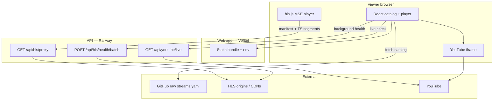
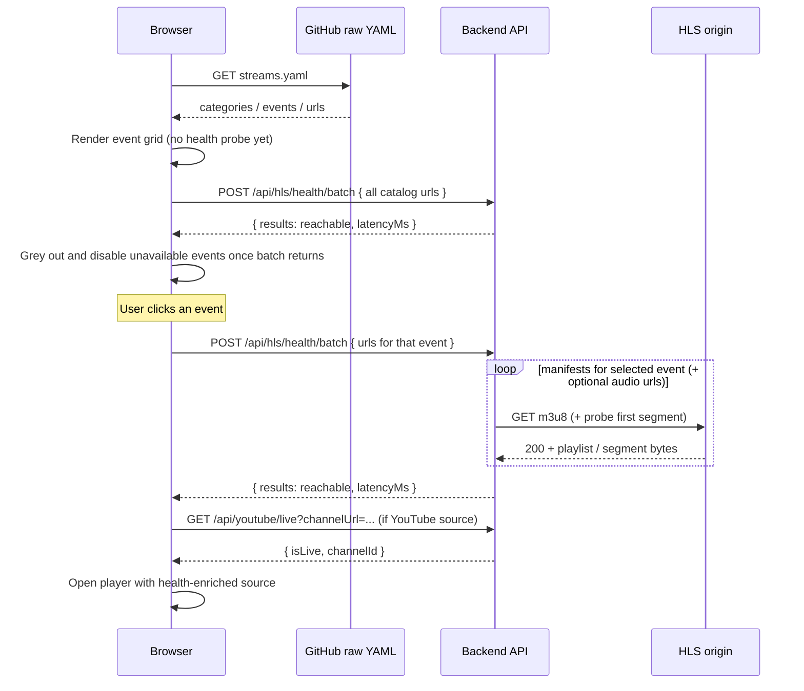
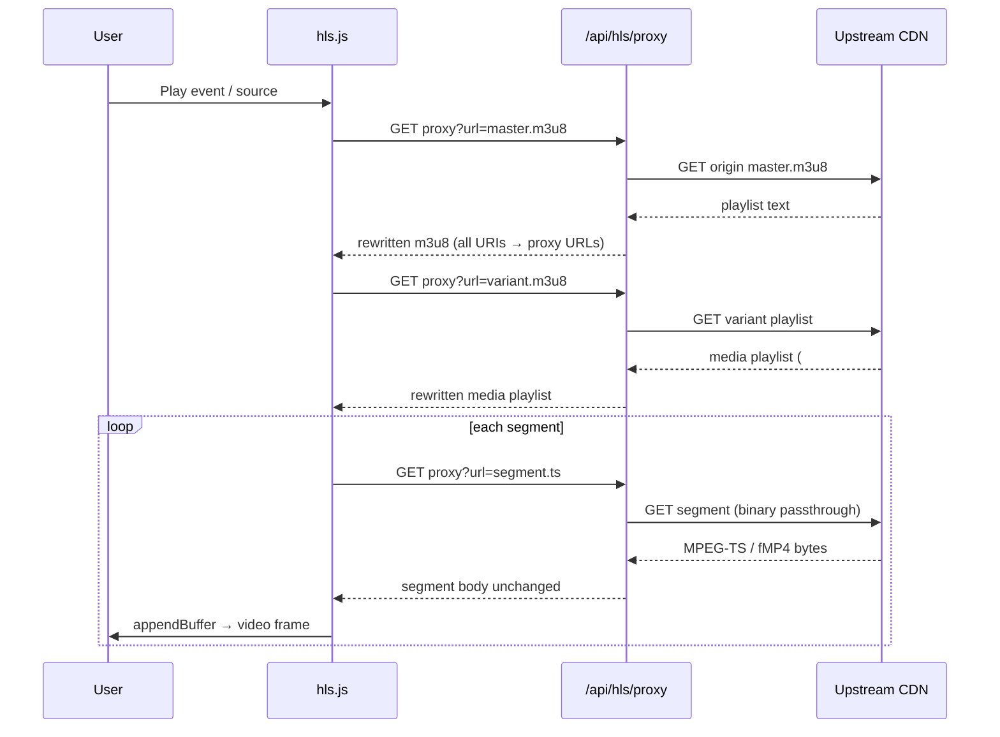

# Live Stream Aggregator

A personal sports live-stream viewer: pick an event, switch sources, and watch in the browser. It aggregates a small curated set of public HLS and YouTube Live feeds in one UI — not a full-scale streaming platform, ingest pipeline, or CDN.

**Live app:** [https://live-stream-aggregator.vercel.app/](https://live-stream-aggregator.vercel.app/)

**Backend API:** [https://live-stream-aggregator-backend-production.up.railway.app/](https://live-stream-aggregator-backend-production.up.railway.app/)

**Backend repo:** [https://github.com/tejasvi-mehra/live-stream-aggregator-backend](https://github.com/tejasvi-mehra/live-stream-aggregator-backend)

Package name: `live-stream-aggregator`

---

## What it does

- Loads a **YAML catalog** of sports categories, events, and stream sources (fetched from GitHub at runtime)
- **HLS playback** via [hls.js](https://github.com/video-dev/hls.js/) through a backend proxy (CORS-safe, rewritten manifests)
- **YouTube Live** via official iframe embeds; live detection runs on the backend
- **Multi-source failover** — automatic and manual source switching within an event
- **Separate audio tracks** — for origins that split video-only and audio-only HLS (e.g. Red Bull TV)
- **Server-side health checks** — background batch probe after catalog load (once per page refresh), plus a fresh check when an event is opened; unavailable events are greyed out and disabled on the grid
- **Catalog search** — matches event names across all categories in a single **Search Results** section (ignores the active category filter while searching)
- **Adaptive bitrate (ABR)** quality picker in the player

Stream quality is the priority: fast startup, low rebuffering, clean ABR, and recovery when a source stalls or dies.

---

## System design

### High-level architecture




### Protocol choice: HTTP Live Streaming (HLS)

This app **passes through** existing HLS feeds — it does not ingest, transcode, or package video itself.


| Approach                          | Used here? | Why                                                                                                            |
| --------------------------------- | ---------- | -------------------------------------------------------------------------------------------------------------- |
| **HLS (M3U8 + TS/fMP4 segments)** | Yes        | Widest browser support via MSE + hls.js; matches how most free sports CDNs and broadcasters deliver live video |
| **LL-HLS**                        | Partially  | Production player profile enables hls.js low-latency tuning where origins support it                           |
| **DASH**                          | No         | Fewer public sports sources expose MPD; adds player complexity for a personal tool                             |
| **WebRTC**                        | No         | Lower latency but needs a WebRTC-capable origin or media server — out of scope for aggregating public URLs     |


HLS works by repeatedly downloading a **playlist** (`.m3u8`) that lists **media segments** (`.ts` or fMP4). The player buffers a sliding window of segments, adapts bitrate from multiple renditions when available, and stays near the live edge.

### How hls.js is used

[hls.js](https://github.com/video-dev/hls.js/) (v1.6.16) runs in the browser:

1. Fetches the manifest through the backend proxy URL
2. Parses master / media playlists
3. Downloads segments via `fetch` + Media Source Extensions (MSE)
4. **ABR** — picks rendition based on bandwidth estimates (`abrEwmaDefaultEstimate`, band factors in `hlsConfig.ts`)
5. **Recovery** — retries on network/media errors; escalates to the next YAML source after configured attempts
6. **Safari fallback** — native HLS when `canPlayType('application/vnd.apple.mpegurl')` is true

Production profile uses tighter buffers and `lowLatencyMode`; test profile uses Apple sample streams with conservative settings.

### End-to-end: catalog load



### Search

When the header search box has text:

1. `filterCatalog()` scans **all** events (category pills are disabled).
2. Matches are case-insensitive substrings of **event name** only (not category name).
3. Results render under one section titled **Search Results**.
4. Empty categories are not shown.

Events stay clickable until background (or per-event) health marks them unavailable. Opening an event before health returns still runs the normal click-time health check.

### Event ids in YAML

Use **globally unique** `events[].id` values (e.g. `redbull-motorsport`, `youtube-f1-live`). Duplicate ids break React list keys and can show the wrong card title when switching between browse and search.

Playback URLs for HLS are rewritten to `https://live-stream-aggregator-backend-production.up.railway.app/api/hls/proxy?url=...` so all subsequent requests are same-origin from the browser’s perspective (relative to the API host).

### End-to-end: HLS playback (data path)




The proxy **rewrites** playlist lines (`#EXT-X-STREAM-INF`, `#EXT-X-KEY`, `#EXT-X-MAP`, segment URIs) so hls.js never talks to third-party origins directly. **Segments** are fetched with `arrayBuffer()` and returned without text decoding — binary-safe for TS.

### YouTube Live path

YouTube is **not** restreamed as HLS. The backend answers “is this channel live?”; the web app embeds:

`https://www.youtube.com/embed/live_stream?channel=CHANNEL_ID`

### Split audio (Red Bull-style)

Some origins expose **video-only** and **audio-only** HLS playlists. The player runs **two** hls.js instances: `<video>` (muted) + hidden `<audio>`. Basic drift sync nudges `audio.currentTime` toward `video.currentTime` on play/seek/timeupdate (~350ms threshold). Broadcast-grade A/V lock (PDT/PCR) is not implemented.

---

## Stream catalog (`streams.yaml`)

Source of truth: `[config/streams.yaml](config/streams.yaml)` in this repo.

At runtime the app fetches:

[https://raw.githubusercontent.com/tejasvi-mehra/live-stream-aggregator/main/config/streams.yaml](https://raw.githubusercontent.com/tejasvi-mehra/live-stream-aggregator/main/config/streams.yaml)

Override with `VITE_CATALOG_URL`. After editing on GitHub, refresh the app (or **Retry catalog**); allow ~1 minute for GitHub CDN cache.

### Top-level shape

```yaml
activeProfile: production   # default profile when VITE_STREAM_PROFILE unset

profiles:
  test:
    description: ...
    categories: [...]
  production:
    description: ...
    categories: [...]
```

### Category → event → stream hierarchy

```yaml
profiles:
  production:
    categories:
      - id: basketball          # slug for filters
        name: Basketball        # display name
        events:
          - id: red-bull-motorsport
            name: Red Bull Motorsport
            featured: true
            logo: https://...
            streams:
              - url: https://play.redbull.com/.../video/1280x720.m3u8
                audio:
                  - url: https://play.redbull.com/.../audio/en.m3u8
                    label: Main
```

### Field reference


| Field                     | Applies to         | Description                                                                                           |
| ------------------------- | ------------------ | ----------------------------------------------------------------------------------------------------- |
| `activeProfile`           | Root               | `test` or `production` — which profile loads by default                                               |
| `profiles.*.description`  | Profile            | Shown in the hero / profile meta                                                                      |
| `categories[].id`         | Category           | Stable slug (`basketball`, `soccer`, …)                                                               |
| `categories[].name`       | Category           | Display label                                                                                         |
| `events[].id`             | Event              | Stable slug within the category                                                                       |
| `events[].name`           | Event              | Title on event cards and player                                                                       |
| `events[].logo`           | Event              | Image URL for cards and hero                                                                          |
| `events[].featured`       | Event              | Optional. First `featured: true` in YAML file order drives the homepage hero; later flags are ignored |
| `streams[].url`           | HLS (default type) | Direct `.m3u8` manifest URL at the origin                                                             |
| `streams[].type`          | Source             | `hls` (default) or `youtube`                                                                          |
| `streams[].audio[]`       | HLS                | Optional separate audio-only manifests                                                                |
| `streams[].audio[].url`   | HLS                | Audio m3u8 URL                                                                                        |
| `streams[].audio[].label` | HLS                | Label in the audio switcher (e.g. `Main`)                                                             |
| `streams[].channelUrl`    | YouTube            | Channel page (`/@handle`, `/channel/UC…`, `/user/name`)                                               |
| `streams[].channelId`     | YouTube            | Optional `UC…` ID; backend can resolve from URL                                                       |


### Profiles


| Profile      | Purpose                                                                 |
| ------------ | ----------------------------------------------------------------------- |
| `test`       | Apple HLS sample streams across all sports — stable ABR/latency testing |
| `production` | Curated mix of public HLS, YouTube, and multi-bitrate sources (default) |


Switch via `activeProfile` in YAML or `VITE_STREAM_PROFILE=test|production`.

---

## Configuration

`VITE_API_BASE` is **required** — the app fails at startup if unset.

**Production:**

```bash
VITE_API_BASE=https://live-stream-aggregator-backend-production.up.railway.app
```

**Local development** (with backend running on port 3002):

```bash
VITE_API_BASE=http://localhost:3002
```

Optional:

```bash
# Hosted catalog (defaults to GitHub raw streams.yaml on main)
VITE_CATALOG_URL=https://raw.githubusercontent.com/tejasvi-mehra/live-stream-aggregator/main/config/streams.yaml

# Strip all YouTube sources at build time
VITE_YOUTUBE_ENABLED=false

# Override active profile without editing YAML
VITE_STREAM_PROFILE=test
```

See [backend README — Environment](https://github.com/tejasvi-mehra/live-stream-aggregator-backend/blob/main/README.md) for API-side variables (`CORS_ORIGIN`, `PUBLIC_API_BASE`, `PROXY_ALLOWLIST`, YouTube detection).

---

## Local development

**Terminal 1 — API**

```bash
git clone https://github.com/tejasvi-mehra/live-stream-aggregator-backend.git
cd live-stream-aggregator-backend
cp .env.example .env
npm install
npm run dev
```

**Terminal 2 — web app**

```bash
git clone https://github.com/tejasvi-mehra/live-stream-aggregator.git
cd live-stream-aggregator
cp .env.example .env
npm install
npm run dev
```

Open [http://localhost:3001](http://localhost:3001)

```bash
npm run dev:test          # Apple HLS samples only
npm run dev:production    # explicit production profile
npm run build
npm run test
```

---

## Resilience behavior


| Scenario                      | Behavior                                                                       |
| ----------------------------- | ------------------------------------------------------------------------------ |
| Fatal HLS network/media error | Exponential backoff retry, then failover to next **untried** visible source in the event |
| All sources fail in playback  | Generic “stream not available” message; event greyed out on catalog; no infinite failover loop |
| Buffer stall                  | Stall timer → recover media / restart load                                     |
| Playback still failing        | Generic “stream not available” message; **Retry** refetches health from API; **Prev/Next** use health-playable sources only |
| Background health batch fails | Catalog stays interactive; no grey-out until a per-event check succeeds        |
| Backend health batch fails on click | Degraded mode: sources marked unverified but playback still attempted      |
| Catalog fetch fails           | Error banner + **Retry catalog**                                               |
| Search with no matches        | “No streams match your search” + **Clear search**                              |
| YouTube channel offline       | Event greyed out after batch check; “Not live” if opened before batch returns  |


---

## Project layout

```
live-stream-aggregator/
├── config/streams.yaml
├── hlsConfig.ts              # hls.js + recovery tuning per profile
├── services/
│   ├── apiBase.ts
│   ├── catalogUrl.ts
│   ├── streamService.ts      # catalog, health, failover
│   ├── catalogHealthCache.ts # sessionStorage + background health merge
│   ├── audioTracks.ts        # split-audio helpers
│   └── youtubeService.ts
├── components/
│   ├── VideoPlayer.tsx       # hls.js + dual audio
│   ├── YouTubePlayer.tsx
│   ├── SourceSwitcher.tsx
│   ├── AudioSwitcher.tsx
│   └── EventCard.tsx
└── ...
```

---

## Trade-offs


| Decision                      | Rationale                                                                    |
| ----------------------------- | ---------------------------------------------------------------------------- |
| **HLS pass-through + proxy**  | No transcoding cost; fixes CORS and centralizes SSRF controls on the API     |
| **YAML catalog on GitHub**    | Edit stream list without redeploying Vercel                                  |
| **hls.js over native-only**   | Consistent behavior across Chrome/Firefox; ABR + error hooks                 |
| **YouTube iframe only**       | Avoids ToS-violating restream; simple live detection on API                  |
| **Background + click health** | Fast catalog render; batch probe once per page load; fresh check when an event opens |
| **Session health cache**      | Liveness stored in `sessionStorage` for the tab; refreshed only on page reload |
| **Name-only search**          | Simple substring match on event titles; “red” matches all RedBull* events      |
| **Thin API, no media server** | Appropriate for personal use — not built to scale to many concurrent viewers |
| **Dual-player split audio**   | Works with Red Bull-style origins; sync is best-effort, not broadcast-grade  |


---

## Possible improvements

- PDT/PCR-based A/V sync for split audio
- Mid-playback health re-check for long sessions
- Prefetch next source manifest on source switch
- Proxy segment streaming via `ReadableStream` instead of buffering full TS in Node
- Move catalog + health into a single API response
- Re-run background health on a timer without full page refresh
- Token or word-boundary search if substring matches are too broad

---

## Costs

**$0** default — public HLS URLs, optional YouTube HTML scrape, Vercel + Railway free tiers. Optional YouTube Data API stays within free quota at personal traffic levels.